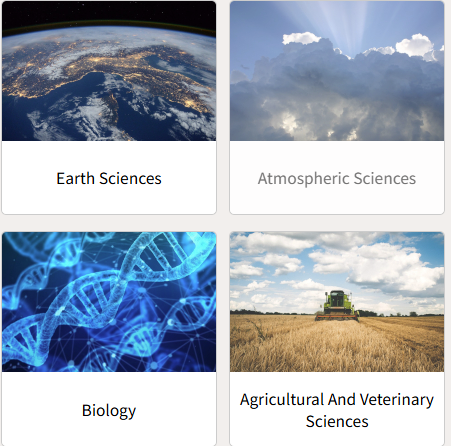
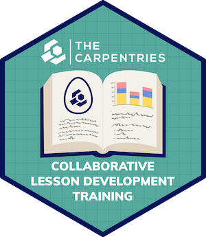
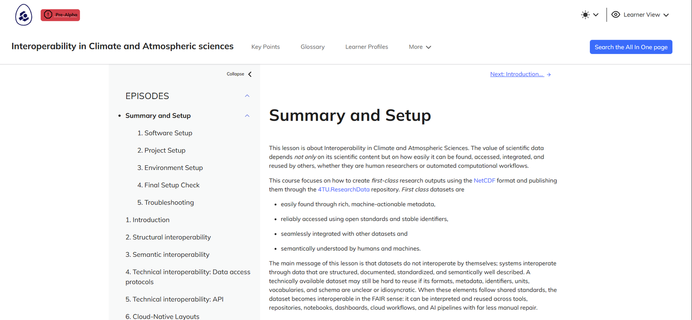

## Who are we {background-image="images/shared/4tu-logo.png" background-size="20%" background-position="96% 94%" background-repeat="no-repeat"}

::: {.columns}
::: {.column width="50%" .center-text}
{width=170 fig-alt="Portrait of Leila Iñigo de la Cruz"}

**Leila Iñigo de la Cruz**\
Digital Competences Trainer\
E: [L.M.InigoDeLaCruz@tudelft.nl](mailto:L.M.InigoDeLaCruz@tudelft.nl)
:::
::: {.column width="50%" .center-text}
{width=170 fig-alt="Portrait of Aleksandra Wilczynska"}

**Aleksandra Wilczynska**\
Data Solutions Engineer\
E: [A.E.Wilczynska@tudelft.nl](mailto:A.E.Wilczynska@tudelft.nl)
:::
:::

## Context

::: {.columns}
::: {.column width="33%" .center-text}
{width=70% fig-alt="4TU.ResearchData logo"}

The repository for Natural, Engineering and Design sciences in NL

{width=70% fig-alt="Earth Sciences and Atmospheric Sciences"}

*Domain specific training needs*
:::
::: {.column width="34%" .center-text}
{width=80% fig-alt="Dutch Interoperability Network logo"}

*A national need on having best practices to embed interoperability into everyday research workflows of different disciplines.*
:::
::: {.column width="33%" .center-text}
{width=55% fig-alt="Carpentries Collaborative Lesson Development Training hex sticker"}

*Opportunity to build accessible, and reusable lesson materials for the community*
:::
:::

::: notes
We have many initiatives in the NL that revolve around building awareness on interoperability from a specific discipline standpoint.
:::

## Interoperability in Climate and Atmospheric sciences

[{fig-alt="Screenshot of the lesson website" width=80% fig-align="center"}](https://4turesearchdata-carpentries.github.io/interoperability-climate-sciences/index.html)

<https://4turesearchdata-carpentries.github.io/interoperability-climate-sciences/index.html>

## Interoperability in Climate and Atmospheric sciences

**Today is the Pilot of the lesson, thanks for participating!**

## Interoperability in Climate and Atmospheric sciences

::: {.center-text}
**Who are you?**

<https://vevox.app/#/m/144372812>

{width=220 fig-alt="QR code for the Vevox session"}
:::
