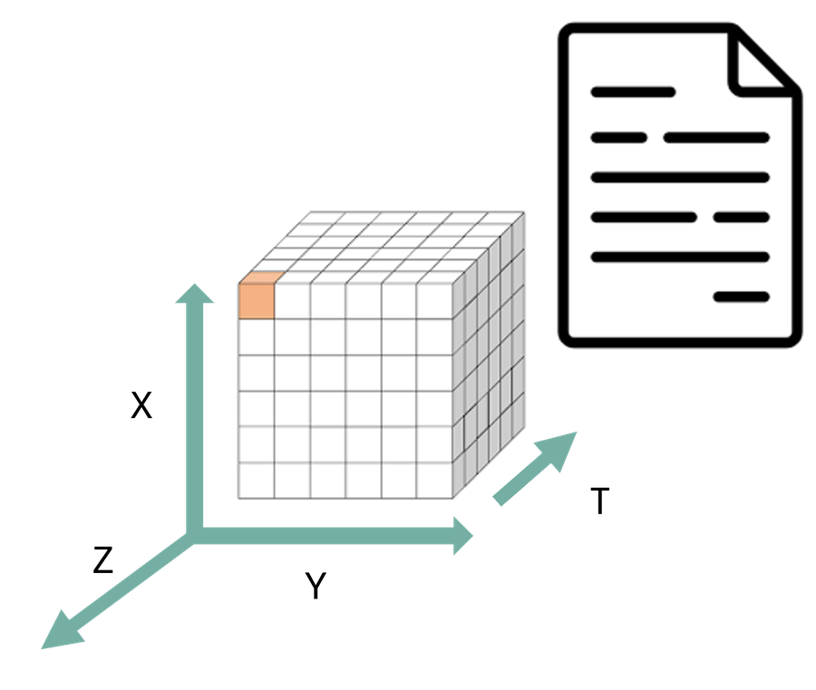

## The Problem

::: {.columns}
::: {.column width="62%"}
::: {.bubble}
Can another tool/software understand how that data is organized and process it without making unnecessary assumptions?
:::
:::
::: {.column width="38%"}
{fig-alt="Ash, a researcher" width="70%" fig-align="center"}
:::
:::

::: notes
This does **not** mean that a machine automatically understands the scientific meaning of every value. Structural interoperability makes the organisation machine-actionable; semantic interoperability addresses whether terms such as `precipitation_flux`, `rainfall_rate`, or `DBZH` are defined and interpreted consistently.
:::

## Structural interoperability

::: {.box}
Organization and representation of the data
:::

::: {.fragment}
::: {.pill}
How they are encoded
:::
::: {.pill}
What kind of data objects exist
:::
::: {.pill}
How their relationships are expressed
:::
:::

::: notes
This definition does not require every explanation to be written directly inside one file. Meaning may also be expressed through persistent identifiers that resolve to external vocabularies, code lists, specifications, instruments, methods, or provenance records. What matters is that the references and relationships are explicit and machine-actionable rather than hidden in personal knowledge, filenames, or informal documentation.
:::

## Structural interoperability

::: {.columns}
::: {.column width="30%"}
::: {.box}
A dataset is structurally interoperable when different software tools can determine:
:::
:::
::: {.column width="70%"}
::: {.incremental .small}
- what records, columns, arrays, variables, or coordinates are present;
- their data types, shapes, and dimensions;
- how different data objects relate to one another;
- which values represent missing data; and
- whether the dataset follows expected structural rules.
:::
:::
:::

::: {.note-box}
This does **not** mean that a machine automatically understands the scientific meaning of every value. Structural interoperability just makes the organisation of the data predictable and machine-actionable.
:::

::: notes
This definition does not require every explanation to be written directly inside one file. Meaning may also be expressed through persistent identifiers that resolve to external vocabularies, code lists, specifications, instruments, methods, or provenance records. What matters is that the references and relationships are explicit and machine-actionable rather than hidden in personal knowledge, filenames, or informal documentation.
:::

## Structural interoperability *is a shared data contract*

**Data model:** the logical structure that software expects to find.

::: {.fragment}
::: {.pill}
Tabular (csv, Parquet)
:::
::: {.pill}
Multidimensional arrays (NetCDF, Zarr)
:::
::: {.pill}
Sequential layered 2D gridded field (GRIB)
:::
::: {.pill}
Raster (GeoTIFF)
:::
::: {.pill}
Geospatial features (GeoPackage)
:::

Choosing a representation that matches the underlying data model helps preserve relationships that software needs.

:::

::: notes
Example of a dataset: forecast data for 5 variables in 10 pressure levels and 24 time steps.
:::

## {background-image="images/structural/data-models.png" background-size="contain" background-color="#ffffff"}

## Choosing a data model

::: {.box}
The choice of data model reflects how you conceptualise the scientific data. Then choose a representation that preserves that structure with the **least** amount of flattening, reconstruction, or artificial complexity.
:::

| If I think of my data as… | Natural model |
|---------------------------|---------------|
| "a collection of observations" | Tabular |
| "variables varying along several shared dimensions" | Multidimensional arrays |
| "a collection of meteorological forecast fields" | GRIB |
| "a georeferenced spatial surface" | Raster |
| "geographic objects with properties" | Geospatial features |

## NetCDF {.smaller}

*a shared data model for multidimensional scientific data*

::: {.columns}
::: {.column width="30%"}

:::
::: {.column width="70%"}
::: {.small}
- **NetCDF:** Network Common Data Form
- Originated at Unidata (part of the University Corporation for Atmospheric Research) in USA in 1989.
- **Why:** Unidata needed a common way for different applications and computer systems to access real-time meteorological data.
- In **1987**, Unidata organised a workshop to explore ideas from NASA's Common Data Format (CDF). Glenn Davis and Russ Rew implemented the first version of NetCDF in 1989.
- The original goal was therefore not simply to invent another file format. NetCDF was designed to provide a portable, self-describing interface for array-oriented scientific data, allowing the same data to be accessed by different software and hardware platforms.
:::
:::
:::

::: {.note-box}
**NetCDF was born from an interoperability problem:** how can scientists store multidimensional data once and allow different programs, programming languages, and computers to understand its structure?
:::

::: notes
We can ask who knows the meaning of the acronym.

At the time, scientific data-access software was often tied to particular machines, applications, or disciplines, making software and data difficult to reuse. (does that ring a bell? haha)
:::

## NetCDF

*a shared data model for multidimensional scientific data*

::: {.columns}
::: {.column width="35%"}

:::
::: {.column width="65%"}
The classic NetCDF data model answers this question using three central structural elements: **dimensions, variables, and attributes.**

- **Dimensions** define named axes and their lengths.
- **Variables** are typed N-dimensional arrays whose shapes are defined using dimensions.
- **Attributes** store metadata associated either with individual variables or with the dataset as a whole.
:::
:::

::: notes
We can ask who knows the meaning of the acronym.

At the time, scientific data-access software was often tied to particular machines, applications, or disciplines, making software and data difficult to reuse. (does that ring a bell? haha)
:::

## What NetCDF does not guarantee

::: {.columns}
::: {.column width="30%"}

:::
::: {.column width="70%"}
::: {.small}
NetCDF defines how dimensions, variables, data types, and attributes can be represented, but it does not by itself require communities to use the same:

- coordinate rules;
- variable names;
- scientific units;
- grid descriptions;
- missing-value practices; or
- terminology for physical quantities.

NetCDF can tell software that these are variables and describe their data types, dimensions, and attributes. However, the NetCDF data model alone does not guarantee that software will understand that they represent the same physical quantity.
:::
:::
:::

::: notes
We can ask who knows the meaning of the acronym.

At the time, scientific data-access software was often tied to particular machines, applications, or disciplines, making software and data difficult to reuse. (does that ring a bell? haha)
:::

## Exercise: identify the structural elements in a NetCDF dataset {.smaller}

Open the OPeNDAP inspection page for the IDRA dataset:\
<https://opendap.4tu.nl/thredds/dodsC/IDRA/2019/01/02/IDRA_2019-01-02_12-00_raw_data.nc.html>

Identify:

1. the global attributes;
2. the dimensions and their lengths;
3. the coordinate variables;
4. three data variables and their dimensions;
5. the data types of those variables;
6. one variable-level attribute that controls the representation of missing data; and
7. any variables that appear to contain descriptive metadata as data values rather than as global attributes.

More: <https://4turesearchdata-carpentries.github.io/interoperability-climate-sciences/structural-interoperability.html>

::: notes
"Easy" means with the fewest assumptions possible about how to integrate them, and also less manual intervention.
:::
