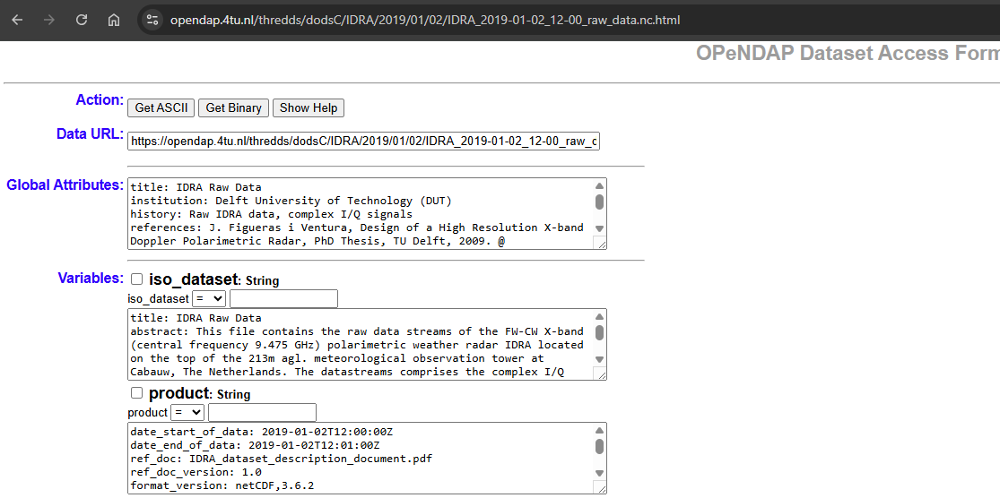

## The Problem

::: {.columns}
::: {.column width="62%"}
::: {.bubble}
Can others understand and reuse the data correctly without making unnecessary assumptions?
:::
:::
::: {.column width="38%"}
{fig-alt="Ash, a researcher" width=70% fig-align="center"}
:::
:::

## Semantic interoperability

::: {.box}
Shared and explicit meaning
:::

::: {.fragment}
::: {.row}
::: {.labelled}
::: {.pill .p-orange}
Free-text label
:::
Human-readable description without controlled meaning, e.g. long name="radar velocity"
:::
::: {.labelled}
::: {.pill .p-grey}
Controlled vocabularies
:::
Approved terms with definitions and governance e.g. CF
:::
::: {.labelled}
::: {.pill .p-red}
Code lists
:::
Permitted values or codes for a particular field
:::
::: {.labelled}
::: {.pill .p-tan}
Taxonomy
:::
Concepts organised through broader, narrower, or related links
:::
::: {.labelled}
::: {.pill .p-cream}
Ontology
:::
Formal concepts, properties, and relationships that may support logical reasoning
:::
:::
:::

::: notes
This definition does not require every explanation to be written directly inside one file. Meaning may also be expressed through persistent identifiers that resolve to external vocabularies, code lists, specifications, instruments, methods, or provenance records. What matters is that the references and relationships are explicit and machine-actionable rather than hidden in personal knowledge, filenames, or informal documentation.
:::

## A semantic resource is more useful when:

::: {.columns}
::: {.column width="45%"}
{fig-alt="Country highway receding to horizon"}
:::
::: {.column width="55%"}
::: {.small}
- its terms have stable identifiers;
- definitions are publicly accessible;
- versions and changes are documented;
- synonyms and deprecated terms are managed;
- relationships between concepts are explicit where needed; and
- the resource is maintained through an open community process.
:::
:::
:::

## Relevant resources

::: {.columns}
::: {.column width="33%" .center-text}
::: {.small}
The home of ontologies and semantic artefacts in Earth System, environment and related domains.
:::

[{fig-alt="EarthPortal" width=60%}](https://earthportal.eu/)

<https://earthportal.eu/>
:::
::: {.column width="34%" .center-text}
::: {.small}
The CF metadata conventions are designed to promote the processing and sharing of NetCDF files. The conventions define metadata that provide a definitive description of what the data in each variable represents, and the spatial and temporal properties of the data.
:::

[{fig-alt="CF Metadata" width=45%}](https://cfconventions.org/)

<https://cfconventions.org/>
:::
::: {.column width="33%" .center-text}
::: {.small}
The authoritative resource that governs the standard names used in CF-compliant datasets
:::

[{fig-alt="CF Standard Name Table" width=70%}](https://cfconventions.org/Data/cf-standard-names/current/build/cf-standard-name-table.html)

[cf-standard-name-table](https://cfconventions.org/Data/cf-standard-names/current/build/cf-standard-name-table.html)
:::
:::

## Exercise

::: {.center-text}
**Can these variables be compared?** (Think-Pair-Discuss)

<https://4turesearchdata-carpentries.github.io/interoperability-climate-sciences/semantic-interoperability.html#semantic-interoperability-through-the-cf-conventions>
:::

::: notes
"Easy" means with the fewest assumptions possible about how to integrate them, and also less manual intervention.
:::

## Exercise (plenum)

::: {.center-text}
**Semantic interoperability: True or False?**

<https://4turesearchdata-carpentries.github.io/interoperability-climate-sciences/semantic-interoperability.html#semantic-interoperability-through-the-cf-conventions>
:::

::: notes
"Easy" means with the fewest assumptions possible about how to integrate them, and also less manual intervention.
:::

## Main elements: Climate and Forecast conventions

| Element | What question does it answer? |
|---------|-------------------------------|
| `standard_name` | What is being measured? |
| `long_name` | How can we describe it for people? |
| `Feature_Type` | What kind of observations are these? E.g. time series, profiles, trajectories |
| `units` | How are the values expressed? (must be compatible with the canonical units of the `standard_name`) |
| Ancillary variables | What additional information is associated with the values? E.g. instrument, quality-control flags |
| `bounds` / `cell_methods` | What does each value represent? |
| Coordinates | Where and when? |

## Compliance check

::: {.columns}
::: {.column width="50%" .center-text}
::: {.pill .pill-lg}
Data
:::

[opendap.4tu.nl: IDRA_2019-01-02_12-00_raw_data.nc](https://opendap.4tu.nl/thredds/catalog/IDRA/2019/01/02/catalog.html?dataset=IDRA_scan/2019/01/02/IDRA_2019-01-02_12-00_raw_data.nc)

{fig-alt="OPeNDAP dataset access form for the IDRA dataset" width=90%}
:::
::: {.column width="50%" .center-text}
::: {.pill .pill-lg}
Tool
:::

<https://compliance.ioos.us/index.html>

[{fig-alt="IOOS Compliance Checker" width=90%}](https://compliance.ioos.us/index.html)

↓

::: {.pill .p-grey}
Report
:::
:::
:::

::: notes
"Easy" means with the fewest assumptions possible about how to integrate them, and also less manual intervention.
:::
