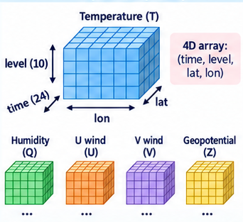
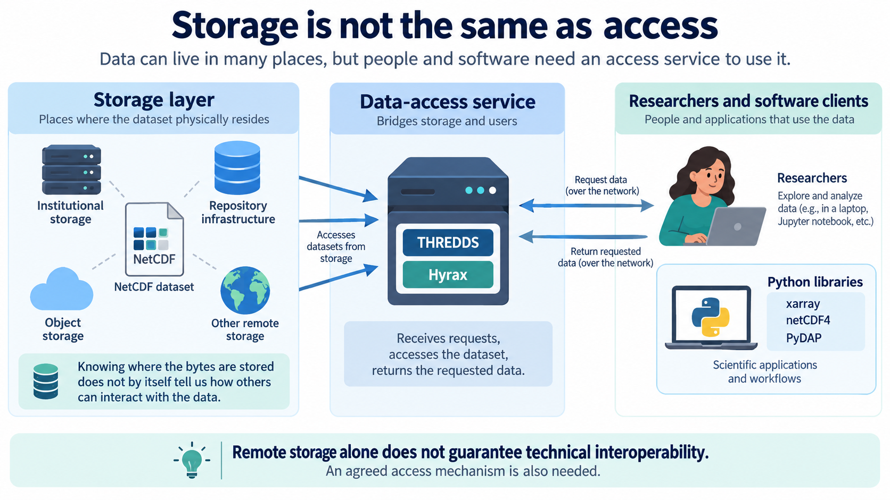
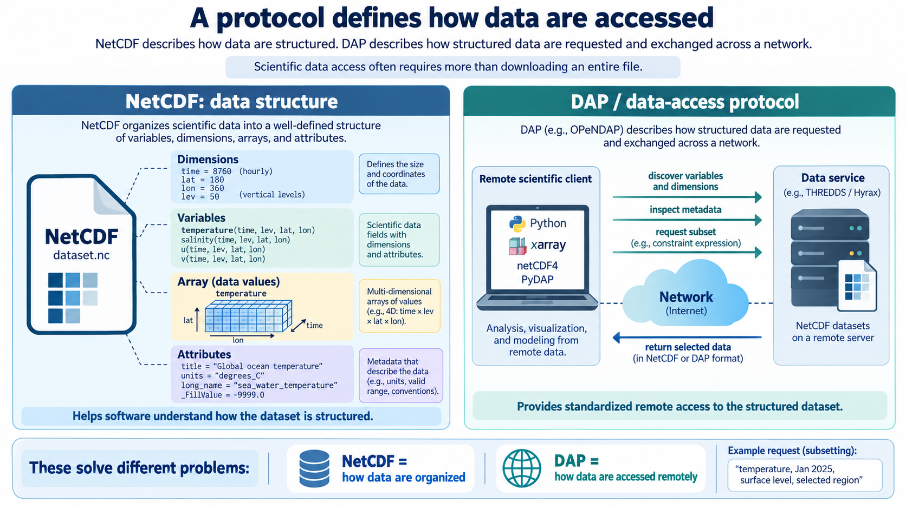

## The Problem

::: {.columns}
::: {.column width="62%"}
::: {.bubble}
**How can one computer system access data held by another system?**
:::

::: {.grey-box}
How can a computer access scientific data stored on a remote system without necessarily downloading the entire file?
:::
:::
::: {.column width="38%"}
{fig-alt="Ash, a researcher" width=70% fig-align="center"}
:::
:::

## Technical interoperability

*concerns*

::: {.box}
The mechanisms that allow independent systems to communicate and exchange data through agreed technical interfaces and protocols
:::

::: notes
This definition does not require every explanation to be written directly inside one file. Meaning may also be expressed through persistent identifiers that resolve to external vocabularies, code lists, specifications, instruments, methods, or provenance records. What matters is that the references and relationships are explicit and machine-actionable rather than hidden in personal knowledge, filenames, or informal documentation.
:::

## Technical interoperability

::: {.columns}
::: {.column width="75%"}
::: {.pill .p-orange .pill-lg}
Example: A climate dataset is stored in a research data repository. A researcher may be interested only in one variable, covering a particular period and geographical region.
:::
:::
::: {.column width="25%"}
{fig-alt="A 4D array (time, level, lat, lon) and the variables that share its dimensions"}
:::
:::

::: {.small}
Approaches:

1. Download the complete file and perform the selection locally
2. The remote infrastructure provides a mechanism through which the researcher can request only the required part of the dataset.

**Which one is more suitable for large scientific datasets and automated computational workflows?**
:::

::: notes
For example, imagine a Python workflow that runs every day and retrieves temperature data for the Netherlands from a global climate dataset. If the workflow has to download the entire global file every time, it repeatedly transfers a large amount of unnecessary data, consumes local storage, and adds extra steps for managing those downloaded files.
:::

## Concepts

::: {.checks}
- **Storage is not the same as access**
:::

{fig-alt="Diagram: storage layer, data-access service, and researchers and software clients" width=80% fig-align="center"}

## Concepts

::: {.checks}
- **A protocol defines how data are accessed**
:::

{fig-alt="Diagram comparing NetCDF as a data structure with DAP as a data-access protocol" width=80% fig-align="center"}

## DAP and OPeNDAP {.smaller}

- The context was: important scientific datasets were distributed across researchers, institutions, and federal data centres, and different systems used different ways of storing and accessing them.
- The problem was: how researchers could access those distributed datasets through a common mechanism, regardless of where the data were physically stored.
- It was created in 1995 as the DODS (*Distributed Oceanographic Data System*).
- It was based on a simple but powerful concept: *"An URL equals a dataset"* and *"An URL with constraints equals a subset"*.
- It started in the oceanography field but because its problem was not specific to that field, it evolved from DODS to a more discipline-neutral name: *Data Access Protocol (DAP)*.
- In 2000, OPeNDAP was created to maintain and develop this infrastructure.
- DAP and OPeNDAP allow independent scientific clients to access distributed structured data through a common protocol.

::: notes
An API is like a waiter in a restaurant. You don't go into the kitchen and cook the meal yourself. You just place an order and hope the kitchen doesn't return a 500 Internal Server Error.
:::

## Hands on session

::: {.center-text}
**Accessing remote NetCDF datasets stored in 4TU.ResearchData using the DAP protocol**

<https://4turesearchdata-carpentries.github.io/interoperability-climate-sciences/protocols.html>
:::

::: notes
HTTP: Hyper Text Transfer Protocol

JSON: JavaScript Object Notation
:::
