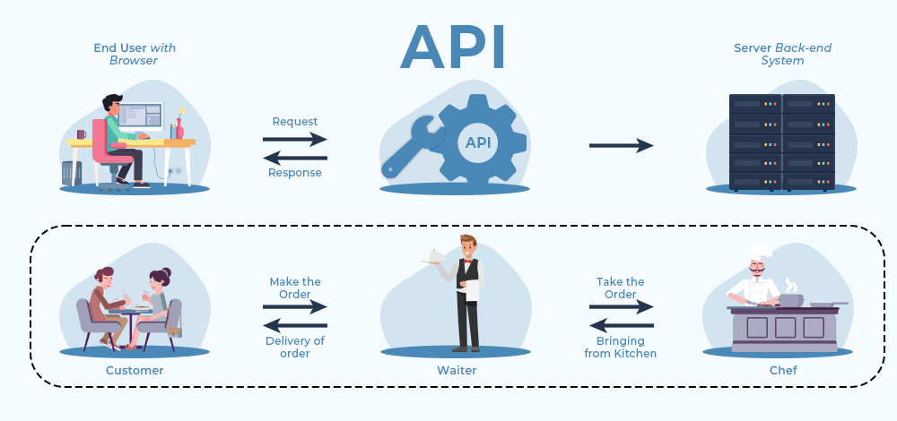

## The Problem

::: {.columns}
::: {.column width="62%"}
::: {.bubble}
**How can one computer system access data held by another system?**
:::

::: {.grey-box}
How can software interact programmatically with the functions and resources provided by another system?
:::
:::
::: {.column width="38%"}
{fig-alt="Ash, a researcher" width=70% fig-align="center"}
:::
:::

## Technical interoperability

*ensures*

::: {.box}
Software systems can reliably exchange data and metadata without human intervention
:::

::: {.fragment}
*is achieved by*

::: {.box}
standardized protocols, e.g. API
:::
:::

::: notes
This definition does not require every explanation to be written directly inside one file. Meaning may also be expressed through persistent identifiers that resolve to external vocabularies, code lists, specifications, instruments, methods, or provenance records. What matters is that the references and relationships are explicit and machine-actionable rather than hidden in personal knowledge, filenames, or informal documentation.
:::

## [01]{.badge} What are APIs

::: {.columns}
::: {.column width="40%" .center-text}
An API (**Application Programming Interface**) defines
:::
::: {.column width="60%"}
how one software system can interact with another in a structured and predictable way.
:::
:::

## What are APIs, in pictures

{fig-alt="Client and server communicating through an API, and the waiter analogy: customer, waiter, chef" width=65% fig-align="center"}

::: notes
An API is like a waiter in a restaurant. You don't go into the kitchen and cook the meal yourself. You just place an order and hope the kitchen doesn't return a 500 Internal Server Error.
:::

## [02]{.badge} APIs can take different forms depending on where and how systems communicate

::: {.columns}
::: {.column width="35%"}
**APIs examples**
:::
::: {.column width="65%" .center-text}
::: {.pill .pill-lg .p-orange}
Library APIs
:::
::: {.pill .pill-lg .p-red}
OS APIs
:::

::: {.pill .pill-lg .p-grey}
Database APIs
:::
::: {.pill .pill-lg .p-cream}
Web APIs
:::
:::
:::

::: notes
**Library or programming APIs** allow software code to interact with functions, classes, or modules provided by a software package.

**Operating system APIs** allow applications to interact with system resources such as files, memory, or hardware.

**Database APIs** allow applications to query and modify information stored in databases.

**Web APIs** allow applications and services to communicate over a network, usually using standard web technologies.

A **Web API** provides a machine-accessible interface through which one system can request data or services from another over the web.

Web APIs are an important mechanism for **technical interoperability** because they allow systems to exchange data and metadata programmatically, without requiring a person to interact manually with a website.
:::

## [03]{.badge} Web APIs usually define: {.smaller}

**Core concepts of Web APIs**

1. **Endpoints**: the address of the resource exposed by the API
2. **HTTP methods**: they use a **shared vocabulary** of methods. GET, POST, PUT, DELETE to define how to exchange **resources** across the web.
3. **Parameters**: additional information to refine the request
4. **Representation**: most Web APIs today use the **JSON** format to exchange data.
5. **Authentication**: mechanism to identify users or software and determine which operations they are allowed to perform.

::: notes
HTTP: Hyper Text Transfer Protocol

JSON: JavaScript Object Notation
:::

## APIs connect structural and semantic interoperability

::: {.row}
::: {.labelled}
::: {.pill .p-grey}
Structural interoperability
:::
JSON responses must follow well defined schemas
:::
::: {.arrow}
→
:::
::: {.pill .pill-lg .p-orange}
APIs
:::
::: {.arrow}
←
:::
::: {.labelled}
::: {.pill .p-salmon}
Semantic interoperability
:::
Metadata fields, controlled terms ensure that machines interpret content consistently
:::
:::

*Without structural and semantic agreement, an API may be technically functional but scientifically meaningless.*

::: notes
Without structural and semantic agreement, an API may be technically functional but scientifically meaningless.
:::

## [04]{.badge} Why APIs are relevant for research

::: {.columns .api-relevance}
::: {.column width="78%"}
::: {.bubble}
Climate and atmospheric research often depends on **large, distributed, and continuously updated datasets** produced by satellites, radar systems, weather stations, numerical models, and research infrastructures.
:::

<p class="small center-text"><b>Relevance of APIs for your discipline</b></p>
:::
::: {.column width="22%"}
{fig-alt="Ash, a researcher" height=280 fig-align="center"}
:::
:::

::: {.fragment}
<p class="small center-text">A typical workflow:</p>

::: {.row}
::: {.pill .p-orange}
Query a data service from radar observations
:::
::: {.arrow}
→
:::
::: {.pill .p-grey}
Retrieve metadata and identify data files
:::
::: {.arrow}
→
:::
::: {.pill .p-red}
Process the selected data in Python
:::
::: {.arrow}
→
:::
::: {.pill .p-tan}
Generate derived products
:::
::: {.arrow}
→
:::
::: {.pill .p-cream}
Publish the results and metadata to a research repository
:::
:::
:::

::: notes
HTTP: Hyper Text Transfer Protocol

JSON: JavaScript Object Notation
:::

## True or False Exercise

<https://4turesearchdata-carpentries.github.io/interoperability-climate-sciences/technical-interoperability.html>

::: notes
HTTP: Hyper Text Transfer Protocol

JSON: JavaScript Object Notation
:::

## Hands on 4TU.ResearchData Web API

1. The Unix terminal allows HTTP requests using `curl`.

`curl` = client URL: send requests and receive responses.

**curl anatomy:**

```bash
curl -X <HTTP_METHOD> <URL> -H "<HEADER_KEY>: <HEADER_VALUE>" -d '<BODY_DATA>'
```

::: notes
HTTP: Hyper Text Transfer Protocol

JSON: JavaScript Object Notation
:::

## Hands on 4TU.ResearchData Web API {.smaller}

- Base URL: <https://data.4tu.nl>
- Specific resource URL (endpoint): <https://data.4tu.nl/v2/articles>
- Open your Unix terminal

::: {.cream-box}
**Exercise: checking the connection with the server using the web browser and `curl` in the Unix terminal**

- Open a web browser and write: <https://data.4tu.nl/v2/articles>
- On the Unix terminal write:

  ```bash
  curl -X GET https://data.4tu.nl/v2/articles | jq
  ```

- How are both responses compared to each other?
:::

::: notes
HTTP: Hyper Text Transfer Protocol

JSON: JavaScript Object Notation
:::
