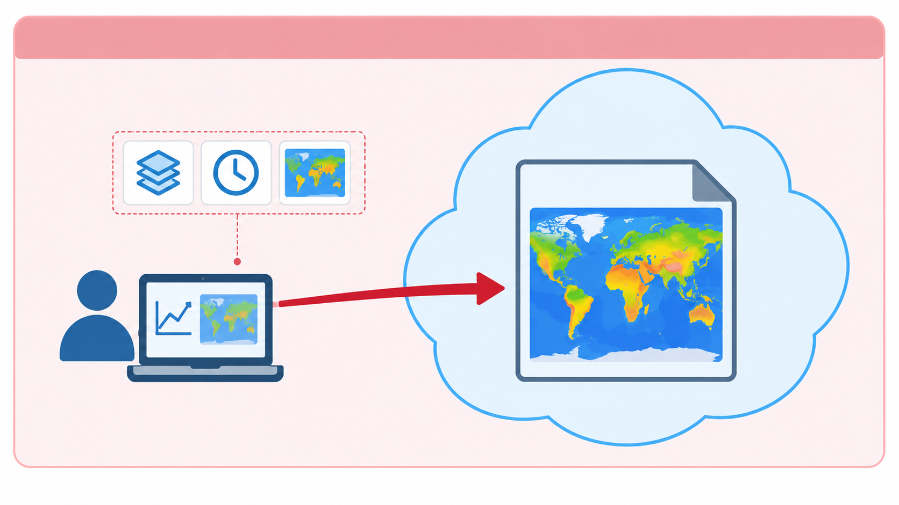
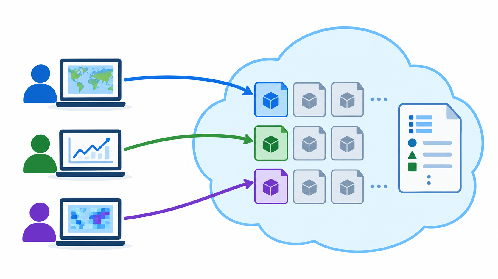

## The Problem

::: {.columns}
::: {.column width="62%"}
::: {.bubble}
Is my data optimised for access even if it is stored in the cloud with a predictable format and following standard metadata conventions?
:::

::: {.small}
Climate datasets are often huge, but researchers usually need only a small subset.

Example: In the [Climate Data Store from Copernicus](https://cds.climate.copernicus.eu/datasets), you are allowed to:

- Select datasets
- Select variables
- Select regions
- Select time-period
:::
:::
::: {.column width="38%"}
{fig-alt="Ash, a researcher" width=70% fig-align="center"}
:::
:::

::: notes
Large data collections such as [ERA5](https://cds.climate.copernicus.eu/datasets/reanalysis-era5-single-levels?tab=overview) or [CMIP6](https://wcrp-cmip.org/cmip-phases/cmip6/) can extend across terabytes or petabytes of data.

Researchers, however, rarely need an entire collection for a particular analysis. A researcher might only need one variable, a short time period, one pressure level, or a small geographical region.
:::

## But how can that be achieved? {.center-text}

::: notes
Large data collections such as [ERA5](https://cds.climate.copernicus.eu/datasets/reanalysis-era5-single-levels?tab=overview) or [CMIP6](https://wcrp-cmip.org/cmip-phases/cmip6/) can extend across terabytes or petabytes of data.

Researchers, however, rarely need an entire collection for a particular analysis. A researcher might only need one variable, a short time period, one pressure level, or a small geographical region.
:::

## Cloud native does not just mean "in the cloud"

::: {.box}
Cloud native is about the access model
:::

::: {.small}
1. Cloud native layouts support workflows in which software retrieves only selected parts of a dataset and can perform multiple reads in parallel.
2. The important idea is therefore not simply **where the data are stored**, but **how the data are organised for access**.
:::

## The traditional file-based workflow

::: {.columns}
::: {.column width="35%"}
**Rationale: One file, one unit of access**
:::
::: {.column width="65%"}
{fig-alt="A researcher accessing one large NetCDF file stored in the cloud"}
:::
:::

::: notes
Many traditional scientific workflows are organised around files. A researcher finds a file on a repository or server, downloads or opens it, selects the required observations, and then performs the analysis.
:::

## Cloud native layouts

::: {.columns}
::: {.column width="35%"}
**Rationale: Break down each file into smaller independently accessible parts**
:::
::: {.column width="65%"}
{fig-alt="Several users reading separate parts of a dataset stored in the cloud"}
:::
:::

::: notes
Many traditional scientific workflows are organised around files. A researcher finds a file on a repository or server, downloads or opens it, selects the required observations, and then performs the analysis.
:::

## NetCDF vs Zarr {.smaller}

::: {.row}
::: {.center-text}
**NetCDF:**\
a primarily file-oriented representation

A NetCDF dataset is commonly packaged into a single binary file.
:::
::: {.arrow}
→
:::
::: {.center-text}
It gets uploaded to an object storage cloud infrastructure
:::
::: {.arrow}
→
:::
::: {.checks}
- Remote access is possible
- Software can use HTTP byte-range requests to retrieve regions of the file.
:::
:::

::: {.dark-box}
But it is not a scalable model for workflows involving many repeated subsets, many parallel readers
:::

::: notes
This definition does not require every explanation to be written directly inside one file. Meaning may also be expressed through persistent identifiers that resolve to external vocabularies, code lists, specifications, instruments, methods, or provenance records. What matters is that the references and relationships are explicit and machine-actionable rather than hidden in personal knowledge, filenames, or informal documentation.
:::

## {background-image="images/cloud/netcdf-in-object-storage.png" background-size="contain" background-color="#ffffff"}

## NetCDF vs Zarr {.smaller}

::: {.row}
::: {.center-text}
**Zarr:**\
a cloud-oriented chunked representation

Zarr divides arrays into smaller pieces called **chunks**. A chunk represents a region of a multidimensional array, can be read independently from the others and its size is a design choice that should match the expected access pattern.
:::
::: {.arrow}
→
:::
::: {.center-text}
It gets uploaded to an object storage cloud infrastructure
:::
::: {.arrow}
→
:::
::: {.checks}
- Remote access is possible.
- Each chunk can be retrieved independently
- Supports parallel access
:::
:::

::: {.box}
The key difference from a cloud perspective is that a Zarr storage layout can expose those chunks as **independently addressable parts of the storage system**
:::

::: notes
Zarr is a format for storing multidimensional arrays together with the metadata needed to interpret them. Like NetCDF, it can represent scientific data with multiple dimensions and variables, but it uses a different physical storage model.
:::

## {background-image="images/cloud/zarr-in-object-storage.png" background-size="contain" background-color="#ffffff"}

## So, then: {.smaller}

::: {.checks}
- Zarr should not be understood simply as a replacement for NetCDF
- NetCDF remains fundamental to climate and atmospheric sciences, large scientific archives, established tools, community conventions, repositories, and existing research workflows depend on it.
- Zarr becomes particularly relevant when multidimensional datasets need to be accessed repeatedly over a network
- Both can represent multidimensional scientific data. What changes is how that data is physically organised and retrieved.
:::

::: notes
Many traditional scientific workflows are organised around files. A researcher finds a file on a repository or server, downloads or opens it, selects the required observations, and then performs the analysis.
:::

## Exercise: What changes in interoperability? {.smaller}

Imagine that the same scientific dataset is moved from a conventional NetCDF file representation to a cloud-native layout such as Zarr. **Think individually for 1–2 minutes, then discuss with a partner:**

Which aspects of interoperability change when moving from a conventional NetCDF file representation to a cloud-native layout such as Zarr? Which aspect is not automatically changed or improved by this move?

Be prepared to explain your reasoning to the group.

::: notes
Many traditional scientific workflows are organised around files. A researcher finds a file on a repository or server, downloads or opens it, selects the required observations, and then performs the analysis.
:::

## Self-paced demo

**Hands-on:**\
**NetCDF to virtual Zarr-compatible access with Kerchunk**

::: notes
Many traditional scientific workflows are organised around files. A researcher finds a file on a repository or server, downloads or opens it, selects the required observations, and then performs the analysis.
:::
